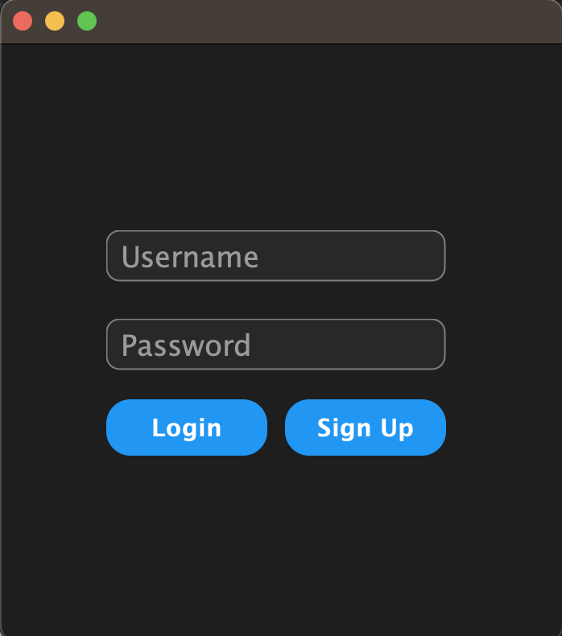
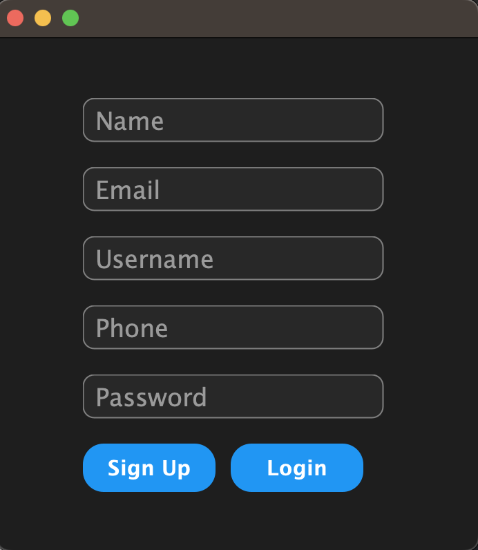
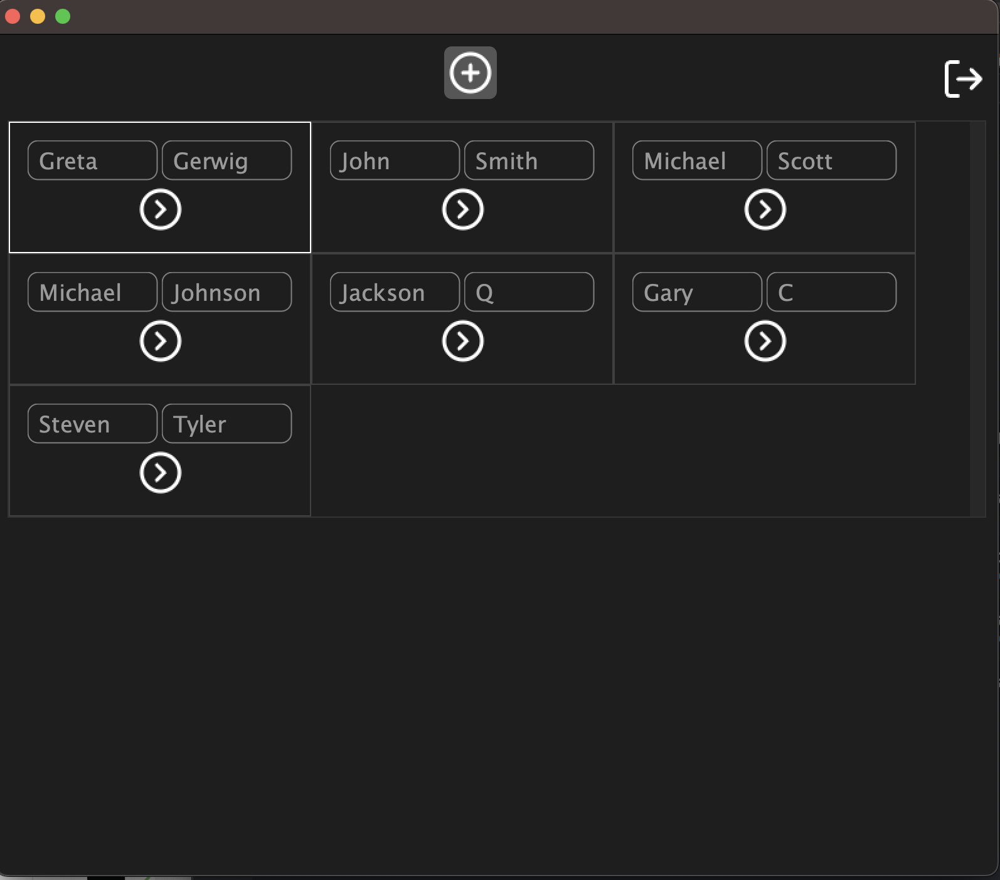
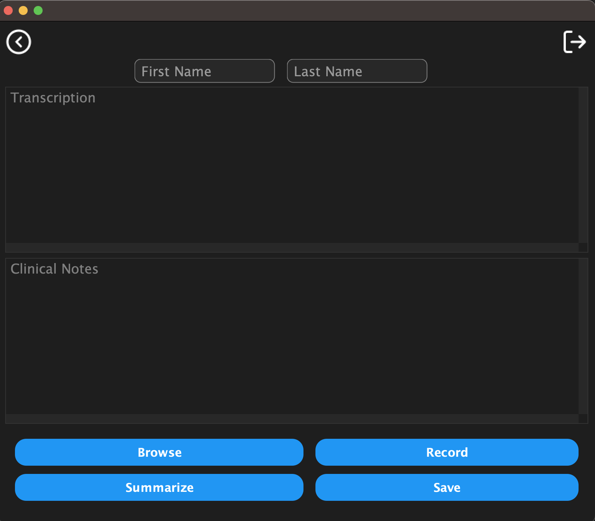
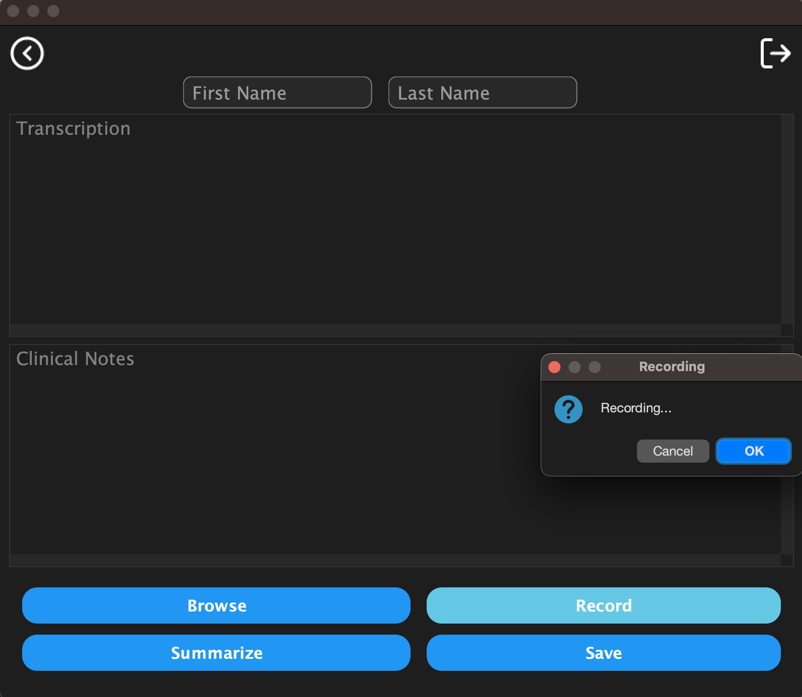
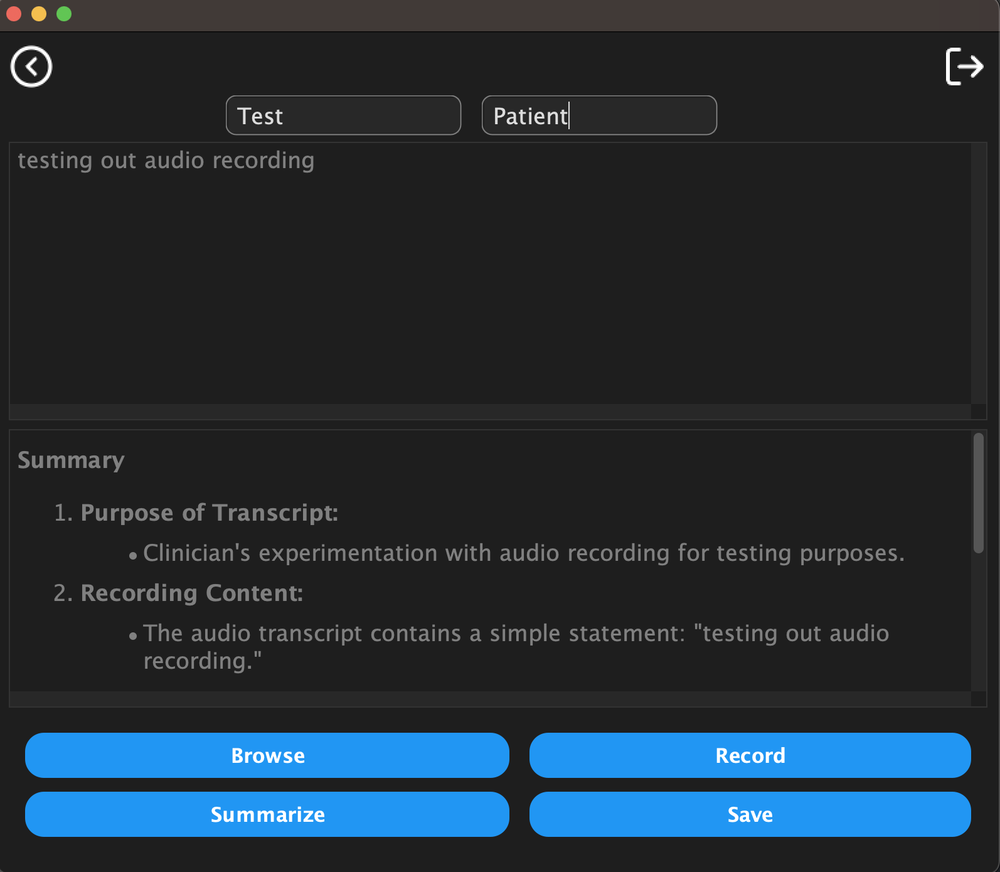
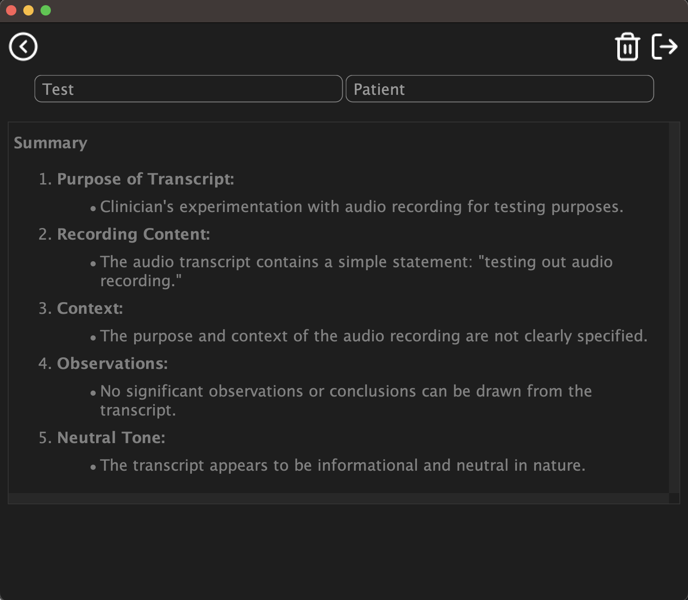

# Medical dictation transcriber - Client using Java Swing

## Prerequisites
1. JDK 17 or greater
2. Gradle 8 or greater

<strong>Preferably, open this project in IntelliJ Idea, which autodetects the Gradle project structure.
</strong>

## Instructions
1. This Swing based client will be run using the command line, i.e, via `gradlew` which is wrapper on top of gradle
2. We can choose to run it in 2 ways, the default way is for the client to communicate with the Railway deployment, and passing a local flag will make it run locally.
3. To run the client, run the following command:
```shell
./gradlew run
```
To connect to the local server:
```shell
./gradlew run --args='local'
```
## Screens
### Login


### Register a new clinic


### Tenant dashboard


### Adding a new patient (click on the + button)


### Recording audio


### After transcribing & summarizing (click on transcribe and then summarize)


### Patient Dashboard
